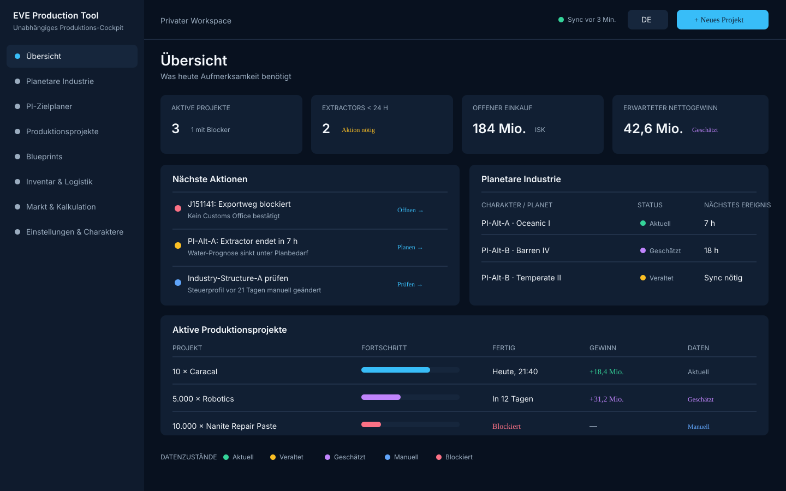
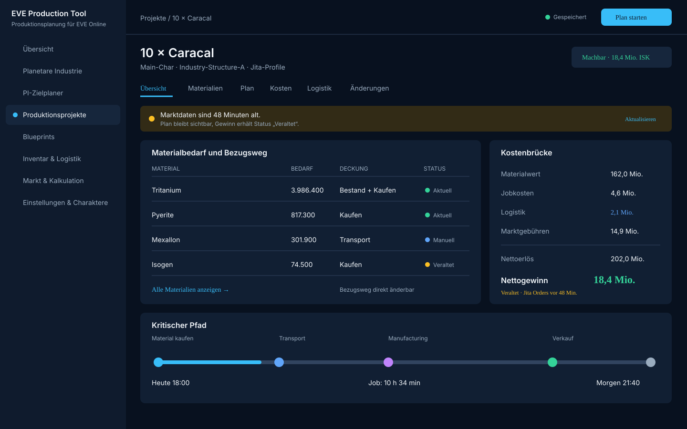
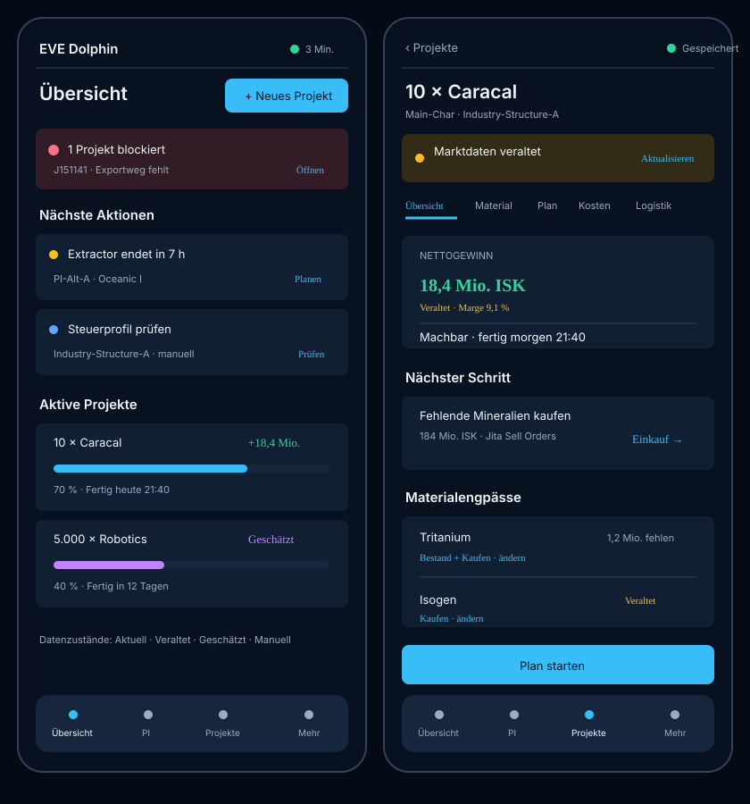

# Seitenstruktur und Wireframes

## 1. Ziel

Diese Spezifikation legt die Informationsarchitektur, Desktop-Navigation, skalierbaren Fensterzustände und kritischen Nutzerwege für Version 1.0 fest. Sie ergänzt die fachlichen Referenzabläufe und den Formel- und Bewertungskatalog. D-014 hat das Ziel von einer Web-App auf einen lokalen Python-Desktop-Client geändert.

Die Wireframes sind bewusst keine finale Farb- oder Markenentscheidung. Sie definieren Anordnung, Hierarchie, Zustände und Aktionen, damit die Implementierung nicht bei jeder Seite neue Bedienmuster erfindet.

## 2. Bediengrundsätze

1. **Handlung vor Statistik:** Blocker, bald endende Extractors und offene Beschaffung stehen vor rein informativen Kennzahlen.
2. **Ein Projekt, eine Wahrheit:** Materialien, PI, Markt, Logistik und Gewinn werden im selben Produktionsprojekt zusammengeführt.
3. **Quelle an jeder kritischen Zahl:** Marktseite, Standort, Datenalter und Bewertungsmethode sind ohne Untermenü erkennbar.
4. **Unsicherheit bleibt sichtbar:** `CURRENT`, `STALE`, `ESTIMATED`, `MANUAL`, `INCOMPLETE` und `BLOCKED` werden niemals gleich dargestellt.
5. **Progressive Offenlegung:** Übersichten zeigen Entscheidungen; Rohdaten und Formeldetails erscheinen auf Abruf.
6. **Fenstergröße ändert nicht die Fähigkeiten:** Bei schmalen Desktop-Fenstern werden Inhalte priorisiert und gestapelt, nicht fachlich entfernt.
7. **Deutsch und Englisch sind gleichwertig:** Navigation, Buttons und Tabellen reservieren Platz für die längere Fassung beider Sprachen.

## 3. Globale Informationsarchitektur

| Hauptansicht | View-ID | Zweck | Wichtigste Aktion |
|---|---|---|---|
| Übersicht | `/overview` | nächste Aktionen, Blocker und Projektstatus | neues Projekt |
| Planetare Industrie | `/pi/colonies` | Kolonien, Extractors, Fabriken und Lager | Kolonie öffnen |
| PI-Zielplaner | `/pi/planner` | PI-Kette rückwärts planen | Ziel berechnen |
| Produktionsprojekte | `/projects` | Projekte suchen, vergleichen und fortsetzen | Projekt erstellen |
| Blueprints | `/blueprints` | BPO/BPC, ME/TE, Runs und Eignung | Blueprint verwenden |
| Inventar & Logistik | `/inventory` | freie/reservierte Assets und Transporte | Transport planen |
| Markt & Kalkulation | `/market` | Preisprofile, Tiefe, Gebühren und Szenarien | Szenario vergleichen |
| Einstellungen & Charaktere | `/settings/characters` | EVE-Verbindungen, Profile, Sprache und Datenstatus | Charakter verbinden |

Detailansichten erhalten stabile interne View-IDs, damit Navigation, Verlauf und spätere Deep Links nicht von Widget-Instanzen abhängen:

- `/pi/colonies/:planetId`
- `/projects/:projectId`
- `/blueprints/:blueprintItemId`
- `/inventory/locations/:locationId`
- `/settings/profiles/:profileId`

## 4. Desktop-Navigation

Bei ausreichender Fensterbreite verwendet die Anwendung eine feste linke Navigation und eine obere Kontextleiste.

### Linke Navigation

- Produktname und unabhängiger Drittanbieterstatus
- alle acht Hauptansichten
- aktive Ansicht mit Text, Icon und Flächenmarkierung
- keine ausschließlich iconbasierte Navigation
- Breite für mindestens `Inventory & Logistics` beziehungsweise `Einstellungen & Charaktere`

### Obere Kontextleiste

- aktives lokales Profil beziehungsweise gewählte Charaktere
- globaler Datenstatus mit letztem erfolgreichen Sync
- Sprache DE/EN
- primäre Aktion `Neues Projekt`

Seitenspezifische Filter, Profile oder Zeiträume gehören in den Inhaltskopf der Seite und nicht in die globale Leiste.

## 5. Kompakte Desktop-Navigation

Bei einem schmalen Fenster wird die linke Navigation auf eine kompakte Icon-/Text-Leiste reduziert. Sie bleibt per Tastatur und Maus vollständig erreichbar und kann jederzeit wieder aufgeklappt werden.

Prioritäten bei wenig Platz:

- Blocker und nächste Aktion zuerst
- Timer und Status vor Diagrammen
- mehrspaltige Bereiche werden in einer festgelegten Reihenfolge gestapelt
- Kostenbrücken werden vertikal dargestellt
- Abhängigkeitsgraphen beginnen als eingerückte Liste; die vollständige Graphansicht bleibt optional
- breite Rohdatentabellen dürfen in einem klar abgegrenzten Bereich horizontal scrollen
- Dialoge bleiben bei hoher Windows-Anzeigeskalierung vollständig bedienbar

## 6. Struktur der Hauptansichten

### 6.1 Übersicht

Reihenfolge:

1. kritische Daten-/Syncwarnung
2. nächste Aktionen nach Dringlichkeit
3. aktive Produktionsprojekte
4. PI-Timer und erwartete Unterversorgung
5. offener Einkauf und Transporte
6. kompakte Ergebniskennzahlen

Jede Aktion führt direkt zum betroffenen Detail und nicht erst zu einer allgemeinen Liste.

### 6.2 Planetare Industrie

Der erste umgesetzte Phase-3-Stand zeigt eine charakterübergreifende Tabelle der atomar
gespeicherten Kolonien und einen Detailbereich. Sichtbar sind Charakter, Planet- und
System-ID, Planetentyp, Pins, Extraktoren, Fabriken, letzte Kolonieaktualisierung sowie im
Detail Links, Routen, Extraktorstatus, Pin-Typen, Produkte, Lagerinhalte und Snapshot-Zeit.
Planet- und Systemnamen sowie Prognosewarnungen werden in den folgenden PI-Bausteinen
ergänzt.

Desktop:

- links Kolonie-/Planetenliste nach Charakter
- Mitte gewählte Kolonie mit Pins, Routen und Lagern
- rechts Timer, Prognose, Engpass und Datenqualität
- lokale Tabs: `Kolonie`, `Produktion`, `Lager`, `Routen`

Kompaktes Desktop-Fenster:

- Charakter und Planet als Auswahl im Seitenkopf
- Timer und Warnungen vor dem Layout
- Pins und Routen als sortierte Liste; grafisches Layout nachgeordnet

### 6.3 PI-Zielplaner

Schrittfolge in einer Seite:

1. Zielprodukt und Berechnungsart: manuelle Menge/Termin oder automatisches Launchpad-Ziel
2. verfügbare Charaktere/Planeten und Bestände
3. Ergebnis mit Machbarkeit, Zyklen und Fehlmengen
4. Entscheidung je Vorstufe: PI, Bestand, Kaufen oder manuell
5. tabellarischen und kompakten grafischen Materialfluss prüfen
6. Projekt speichern

Im Launchpad-Modus werden Zielmenge und Zeitraum nicht als Eingaben verlangt. Der Nutzer
wählt Kapazität und Zahl der Endfabriken; Stückzahl, Restvolumen und Füllzeit werden aus den
aktiven SDE-Volumen und Zykluszeiten berechnet.

Bei ausreichender Breite stehen Eingaben links und Ergebnisse rechts. Im kompakten Fenster werden die Blöcke in derselben Reihenfolge gestapelt; das Ergebnis bleibt nach einer Neuberechnung im sichtbaren Bereich.

### 6.4 Produktionsprojekte

Listenansicht:

- Status, Zielprodukt, Fortschritt, Fertigstellung, erwarteter Gewinn und Datenqualität
- Filter für Status und verantwortlichen Charakter
- keine standardmäßige Sortierung nur nach Gewinn; Blocker und Termin haben Vorrang

Detailansicht mit Tabs:

- `Übersicht / Overview`
- `Materialien / Materials`
- `Plan / Schedule`
- `Kosten / Costs`
- `Logistik / Logistics`
- `Änderungen / Changes`

Die Übersicht zeigt Ziel, Machbarkeit, nächsten Schritt, Kostenbrücke und kritischen Pfad. Build-or-Buy-Überschreibungen sind direkt an der Materialzeile möglich.

### 6.5 Blueprints

- Suche nach Produkt oder Blueprint
- BPO/BPC, Besitzer, Standort, Runs, ME und TE
- Eignung für ein gewähltes Projekt
- Detailbereich mit Materialien, Output und Basiszeit aus dem aktiven SDE
- Aktion `Für Projekt verwenden`

Blueprint-Instanzdaten und SDE-Rezept werden optisch getrennt, aber gemeinsam gezeigt.

### 6.6 Inventar & Logistik

Desktop:

- Standortbaum beziehungsweise Standortfilter links
- Bestände in der Mitte
- Reservierungen und geplante Transporte rechts

Kompaktes Desktop-Fenster:

- Standortauswahl im Kopf
- Bestand zuerst, danach Reservierungen und Transporte

Jede Menge zeigt `vorhanden`, `reserviert`, `frei` und `am Projektort verfügbar`. Bestände an einem anderen Ort werden nie als lokale Verfügbarkeit dargestellt.

### 6.7 Markt & Kalkulation

- Marktprofil mit Region, Station/Struktur und Zeitstempel
- getrennte Buy-/Sell-Seite und ausgewertete Menge
- Mengentiefe und VWAP
- Gebührenprofil des Charakters/Standorts
- Vergleich `Replacement`, `Liquidation`, `Planned Buy`, `Planned Sell`, `Acquisition`, `Internal`
- erklärbare Kostenbrücke bis zum Nettogewinn

Unvollständige Markttiefe stoppt eine vollständige Gewinnfreigabe und bietet nur ein ausdrücklich markiertes Fallback-Szenario an.

### 6.8 Einstellungen & Charaktere

Unterseiten:

- EVE-Charaktere und progressive Scopes
- Marktprofile
- Produktionsstandorte und Boni
- POCO-/Skyhook-Profile
- Transport- und Wurmlochprofile
- Sprache, Zeitzone und Anzeige
- SDE-/ESI-Datenstatus

Scopes werden als verständliche Funktion beschrieben, nicht nur als technische Kennung. Ein erneutes Verbinden betrifft nur den ausgewählten Charakter.

## 7. Kritische Nutzerwege

| Nutzerziel | Maximaler Weg ab Hauptansicht | Ergebnis |
|---|---:|---|
| neues Manufacturing-Projekt | `Neues Projekt` → Produkt/Menge → Profile/Termin → Plan | Projektentwurf in höchstens 3 Entscheidungen nach dem Start |
| PI-Ziel planen | `PI` → `Zielplaner` → Ziel/Menge/Termin → Ergebnis | Machbarkeit und Fehlmengen ohne Seitenwechsel |
| dringenden Blocker lösen | Warnung → betroffene Ursache → Aktion | Ursache in höchstens 2 Navigationsebenen |
| Build-or-Buy ändern | Projekt → Materialzeile → Bezugsweg | Plan und Kosten werden in derselben Ansicht neu berechnet |
| Charakter verbinden | Einstellungen → Charakter verbinden → EVE SSO → Scope-Prüfung | nur freigegebene Module werden aktiviert |
| Einkaufsliste übernehmen | Projekt → Einkauf → Kopieren/CSV | nach Standort und Marktprofil gruppierte Liste |
| Transport planen | fehlender Standortbestand → Transport planen | Volumen, Fahrten, Route und Kosten sind vorausgefüllt |

Zurück-Navigation erhält Filter, Tab und Scrollposition der Ausgangsansicht.

## 8. Datenzustände und visuelle Sprache

Farbe wird immer mit Icon, Text und Zeitstempel kombiniert.

| Zustand | DE / EN | Darstellung | Verhalten |
|---|---|---|---|
| `CURRENT` | Aktuell / Current | Haken, neutral-grün | normal verwendbar |
| `STALE` | Veraltet / Stale | Uhr, gelb, letzter Stand | verwendbar mit sichtbarer Warnung |
| `ESTIMATED` | Geschätzt / Estimated | Wellenlinie, violett | Bandbreite/Annahme anzeigen |
| `MANUAL` | Manuell / Manual | Stift, blau | Quelle, Nutzer und Änderungszeit zeigen |
| `INCOMPLETE` | Unvollständig / Incomplete | offener Kreis, orange | fehlende Eingabe nennen |
| `BLOCKED` | Blockiert / Blocked | Stoppsymbol, rot | nicht in verfügbare Mengen einrechnen |
| `ERROR` | Fehler / Error | Warnsymbol, rot | Wiederholung oder konkrete Hilfe anbieten |

Eine gemischte Berechnung erhält den schwächsten relevanten Zustand. Beispielsweise wird ein Gewinn mit aktuellen Orders, aber manueller POCO-Steuer als `MANUAL`, mit unvollständiger Markttiefe als `INCOMPLETE` ausgewiesen.

## 9. DE-/EN- und Barrierefreiheitsregeln

- Texte werden nicht in Komponenten hartcodiert.
- Navigation und Aktionsbereiche werden mit beiden Sprachen sowie mindestens `30 %` Textreserve geprüft.
- wesentliche Bezeichnungen werden nicht mit Ellipse abgeschnitten; sie umbrechen oder erhalten mehr Raum.
- Zahlen und Einheiten bleiben zusammen, beispielsweise `2,55 Mio. ISK`.
- Status darf nie ausschließlich über Farbe kommuniziert werden.
- Tastaturreihenfolge folgt der visuellen Reihenfolge.
- Fokus bleibt nach Neuberechnung oder Dialogschluss nachvollziehbar.
- Formulare besitzen sichtbare Labels; Platzhalter ersetzen keine Labels.
- Bedienelemente bleiben bei `100 %`, `150 %` und `200 %` Windows-Anzeigeskalierung erreichbar.
- Prüfung mit Tastaturbedienung, hoher Skalierung und der festgelegten minimalen Fenstergröße gehört zur Abnahme.

## 10. Wireframes

### Desktop – Übersicht

### Desktop – Produktionsprojekt

### Historische mobile Skizze

Diese Skizze bleibt als Dokumentation der ursprünglichen PWA-Planung erhalten, ist nach D-014 jedoch kein Abnahmekriterium für Version 1.0.

## 11. Abnahmematrix

| Kriterium aus Issue #5 | Nachweis |
|---|---|
| Desktop-Struktur aller Hauptansichten | Abschnitt 6 und Desktop-Wireframes |
| Kompakte Desktop-Navigation | Abschnitt 5 und Desktop-Wireframes |
| kurze kritische Nutzerwege | Abschnitt 7 |
| optisch getrennte Datenzustände | Abschnitt 8 und Statusdarstellung in den Wireframes |
| DE/EN und längere Texte | Abschnitte 3, 6.4 und 9 |
